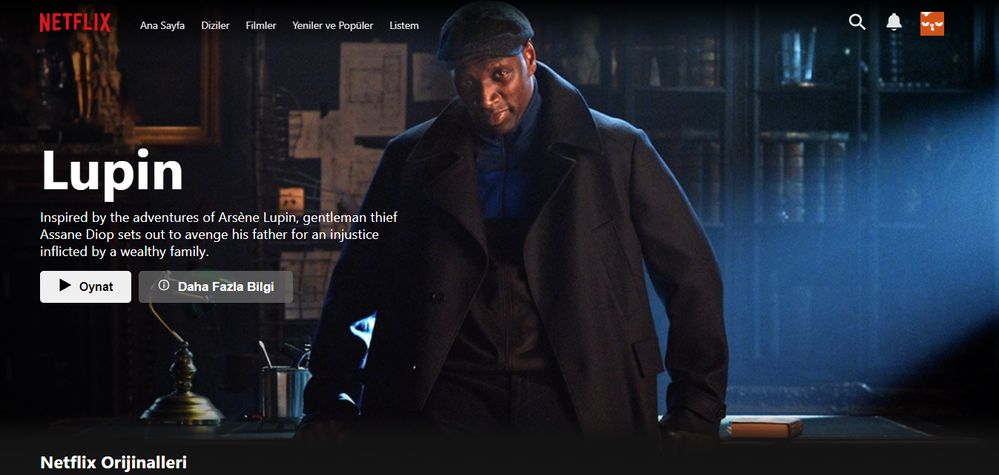
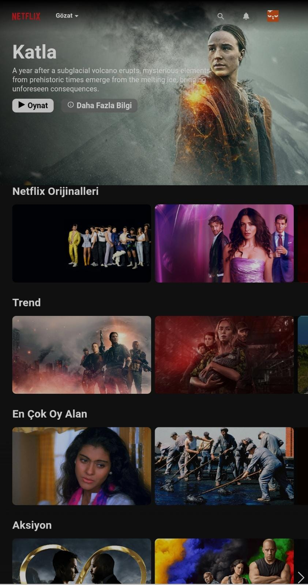

# **Netflix Clone**
## Uygulamadan Resimler

## Özet
**HTML**, **CSS**, **JavaScript** ve **React.js** ile yazmış olduğum bir uygulamadır. Uygulamanın önyüzü Netflix ile aynı olmakla beraber uygulama responsivedir. Uygulama içindeki veriler The Movie Database(TMDb) API servisinden alınmaktadır. 

## Projede Kullanılan Teknoloji/Metotlar
The Movie Database(TMDb) API servisinden verileri almak için Axios kütüphanesi ile gerekli sorgular yollanıp veriler alınmıştır. Alınan veriler React.js'in özelliği olan hooklar ile tutulup aynı şekilde React.js kütüphanesi ile uygulamanın önyüzü oluşturuldu. 

## Kurulum
Projeyi çalıştırabilmek için proje klasöründe

`npm install`

komutu ile projenin bağımlı olduğu kütüphanelerin kurulumunu yapmanız gerekmektedir.

İndirme işlemi tamamlandıysanız

`npm start`

komutu ile projeyi çalıştırabilirsiniz.

